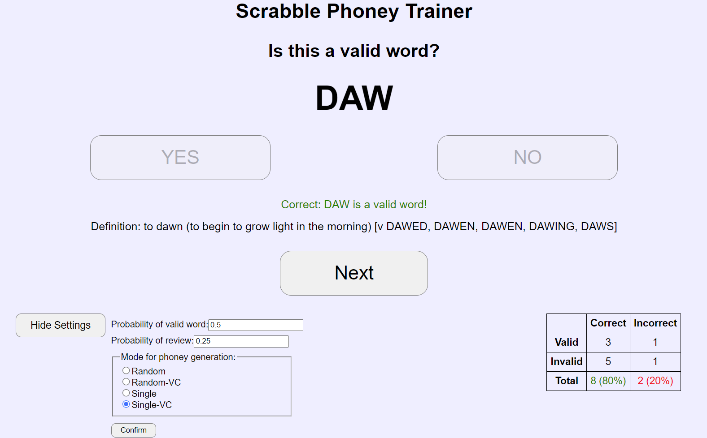

# Scrabble Phoney Trainer

**Scrabble Phoney Trainer** is a tool to help you memorize short valid Scrabble words. After selecting a custom dictionary file, you will be presented with a word. You need to figure out if the word is a valid word or a phoney.

The tool works best for two- and three-letter words because it's harder to generate plausible-looking phonies for longer words.

## Format for Dictionary File

- To use a dictionary file with just words and no definitions, put one word on every line.
- To use a dictionary file with both words and definitions, put one word-definition pair on every line, using a tab to separate the word and the definition.
- You can export a list from a Zyzzyva search using `Right click -> Save list... -> Format: One Word Per Line -> OK` and the list will be in the correct format for this application. 

## Supported Modes for Phoney Generation

The following modes for generating phonies are currently supported:

- Random: Pick a random valid word, and generate a random word with the same number of characters.
  - Example: `CAT -> EWM`
  - This mode should be the easiest since most random strings of characters are not valid words.
- Random-VC: Pick a random valid word, and generate a random word with the same number of characters. If the `i`th letter of the valid word is a vowel, then so is the `i`th letter of the random word. The same goes for consonants.
  - Example: `CAT -> LIK`
- Single: Pick a random valid word, and change one random letter of the word to another random letter.
  - Example: `CAT -> CAU`
- Single-VC (*default*): Pick a random valid word, and change one random letter of the word to another random letter. If the original letter was a vowel, it will be changed to a vowel. The same goes for consonants.
  - Example: `CAT -> CIT`

For all these modes, if the generated word happens to be valid, another one will be generated.

## Customizable Parameters

- The parameter `validProb` specifies the probability that the next word is valid.
- The parameter `reviewProb` specifies the probability that the next word is a review of your previous mistake (false positive or false negative). If the next word is valid, you can only get a review question if you previously had at least one false negative. Similarly, if the next word is invalid, you can only get a review question if you previously had at least one false positive. The probability that a word is drawn is proportional to the number of times you got it wrong, so you're more likely to review a word that you got wrong many times.

## Fun Fact

The plural of `phony` is `phonies` while the plural of `phoney` is `phoneys` or `phonies`. All these words are valid. However, `phonys` is phony!
